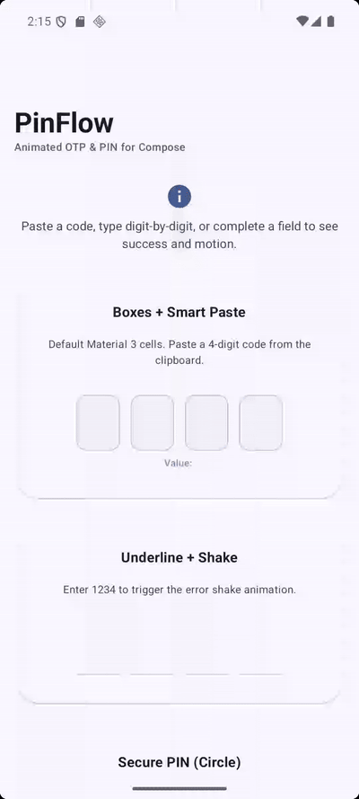
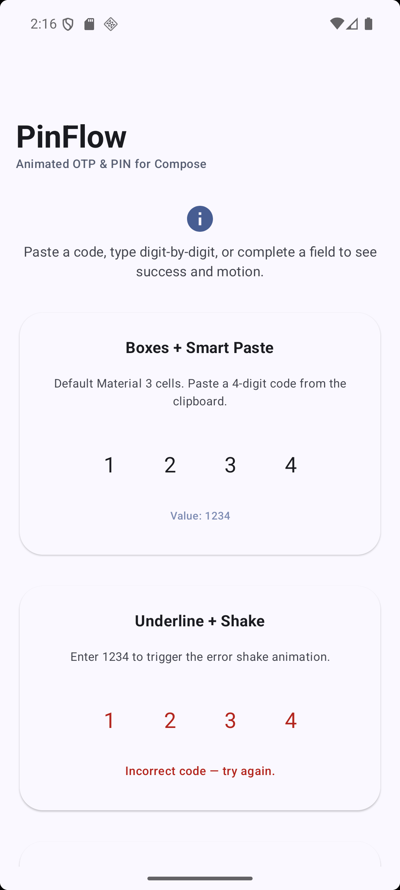
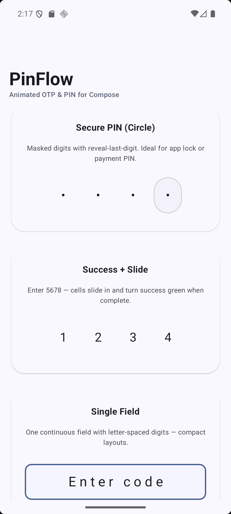
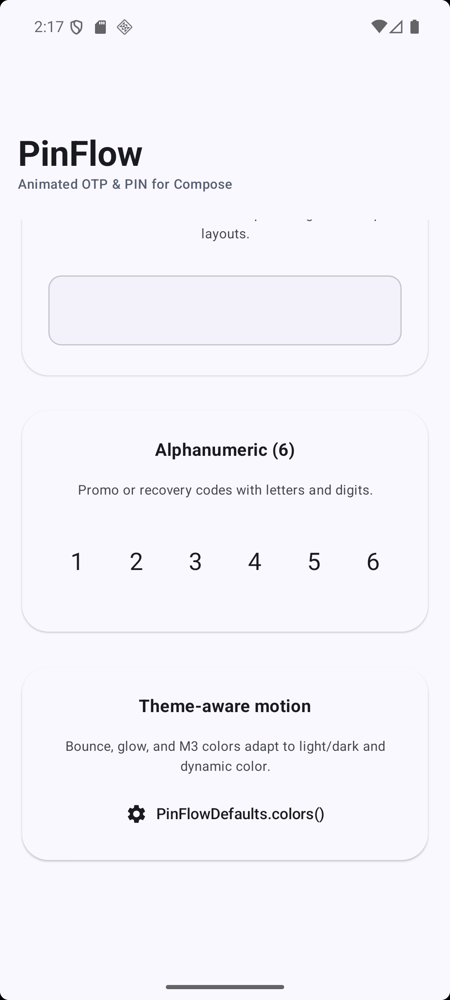

# PinFlow

[](https://github.com/saadkhalidkhan/PinFlow/actions/workflows/ci.yml)
[](https://github.com/saadkhalidkhan/PinFlow/actions/workflows/docs.yml)
[](https://central.sonatype.com/artifact/io.github.saadkhalidkhan/pinflow-compose)
[](https://jitpack.io/#saadkhalidkhan/PinFlow)
[](https://github.com/saadkhalidkhan/PinFlow/releases)
[](LICENSE)
[](https://android-arsenal.com/api?level=23)
[](https://kotlinlang.org)
[](https://developer.android.com/jetpack/compose)

**PinFlow** is a lightweight, animated, and customizable **OTP / PIN input** library for Jetpack Compose. Built with Material 3, smart paste handling, secure PIN mode, and smooth interaction states — add polished verification flows in minutes.

[**Report a bug**](https://github.com/saadkhalidkhan/PinFlow/issues) · [**Contributing**](CONTRIBUTING.md) · [**Security**](SECURITY.md)

<p align="center">
  
</p>

---

## Table of contents

- [Features](#features)
- [Preview](#preview)
- [Installation](#installation)
- [Quick start](#quick-start)
- [Usage examples](#usage-examples)
- [API documentation](#api-documentation)
- [Sample app](#sample-app)
- [Publishing & CI](#publishing--ci)
- [Contributing](#contributing)
- [License](#license)
- [Author](#author)

## Features

| Feature | Description |
|---------|-------------|
| **Single hidden field** | One `BasicTextField` — reliable keyboard, paste, and a11y |
| **Smart paste** | Paste `123456` and all slots fill automatically |
| **Modes** | `Boxes`, `Underline`, `Circle`, `SingleField`, `SecurePin` |
| **Motion** | `Bounce`, `Glow`, `ShakeOnError`, `Slide` — pick per screen |
| **Secure PIN** | Masking + optional reveal-last-digit |
| **Validation** | `PinFlowValidator` helpers + `onComplete` callback |
| **Material 3** | `PinFlowDefaults.colors()` / `dimensions()` |
| **Gradient borders** | `borderBrush = Brush.linearGradient(...)` |
| **Cursor styling** | `cursorColor`, `cursorWidth` on focused cells |
| **Custom cells** | `cellContent = { digit, state -> … }` |
| **Haptics** | `hapticEnabled = true` on digit entry |
| **Preset themes** | `PinFlowThemes.Default` / `Glass` / `Neon` / `Minimal` |

---

## Preview

| Boxes + smart paste | Underline + shake | Alphanumeric (6) |
|:---:|:---:|:---:|
|  |  |  |

---

## Installation

### Maven Central

```kotlin
// settings.gradle.kts
dependencyResolutionManagement {
    repositoriesMode.set(RepositoriesMode.FAIL_ON_PROJECT_REPOS)
    repositories {
        google()
        mavenCentral()
    }
}
```

```kotlin
// build.gradle.kts
dependencies {
    implementation("io.github.saadkhalidkhan:pinflow-compose:1.1.1")
}
```

Available on Maven Central. See [PUBLISHING.md](PUBLISHING.md) for newer versions and [RELEASE_CHECKLIST.md](RELEASE_CHECKLIST.md) to ship releases.

### JitPack

[](https://jitpack.io/#saadkhalidkhan/PinFlow/v1.1.1)

**Step 1.** Add the JitPack repository in `settings.gradle.kts` (at the end of `repositories`):

```kotlin
dependencyResolutionManagement {
    repositoriesMode.set(RepositoriesMode.FAIL_ON_PROJECT_REPOS)
    repositories {
        google()
        mavenCentral()
        maven { url = uri("https://jitpack.io") }
    }
}
```

**Step 2.** Add the dependency in `build.gradle.kts`:

```kotlin
dependencies {
    implementation("com.github.saadkhalidkhan:PinFlow:1.1.1")
}
```

Build status: [JitPack builds](https://jitpack.io/#saadkhalidkhan/PinFlow/v1.1.1) for tagged releases.

### Local module (development)

```kotlin
dependencies {
    implementation(project(":pinflow"))
}
```

---

## Quick start

```kotlin
import com.pinflow.compose.PinFlow
import com.pinflow.compose.PinFlowMode
import com.pinflow.compose.PinFlowValidator

var code by remember { mutableStateOf("") }

PinFlow(
    value = code,
    onValueChange = { code = it },
    length = 6,
    mode = PinFlowMode.Boxes,
    isSuccess = PinFlowValidator.isComplete(code, 6),
    onComplete = { submitted -> verifyOnServer(submitted) },
)
```

---

## Usage examples

### Secure PIN (app lock / payment)

```kotlin
PinFlow(
    value = pin,
    onValueChange = { pin = it },
    mode = PinFlowMode.SecurePin,
    revealLastDigit = true,
)
```

### Error shake

```kotlin
val isError = code == "1234"

PinFlow(
    value = code,
    onValueChange = { code = it },
    mode = PinFlowMode.Underline,
    isError = isError,
    animations = setOf(PinFlowAnimation.ShakeOnError, PinFlowAnimation.Bounce),
)
```

### Success + slide (demo code `5678`)

```kotlin
PinFlow(
    value = code,
    onValueChange = { code = it },
    isSuccess = PinFlowValidator.isComplete(code, 4) && code == "5678",
    animations = setOf(PinFlowAnimation.Slide, PinFlowAnimation.Glow),
)
```

### Custom theme & size

```kotlin
PinFlow(
    value = otp,
    onValueChange = { otp = it },
    colors = PinFlowDefaults.colors(),
    dimensions = PinFlowDefaults.dimensions(
        cellWidth = 52.dp,
        spacing = 10.dp,
        cornerRadius = 14.dp,
    ),
    animations = setOf(PinFlowAnimation.Slide, PinFlowAnimation.Glow),
)
```

### Single-field layout

```kotlin
PinFlow(
    value = code,
    onValueChange = { code = it },
    length = 6,
    mode = PinFlowMode.SingleField,
)
```

### Validation helpers

```kotlin
PinFlowValidator.isComplete(otp, length = 6)
PinFlowValidator.isNumeric(otp)
PinFlowValidator.hasRepeatedDigits(otp)
```

### Gradient borders & cursor

```kotlin
PinFlow(
    value = code,
    onValueChange = { code = it },
    borderBrush = Brush.linearGradient(
        colors = listOf(Color(0xFF00E5FF), Color(0xFFFF00E5)),
    ),
    cursorColor = Color.Red,
    cursorWidth = 3.dp,
)
```

### Preset themes (light / dark adaptive)

```kotlin
PinFlow(
    value = code,
    onValueChange = { code = it },
    style = PinFlowThemes.Neon(),
    hapticEnabled = true,
)
```

Themes: `PinFlowThemes.Default()`, `Glass()`, `Neon()`, `Minimal()`. Override individual props (`borderBrush`, `cursorColor`, …) when needed — they take precedence over `style`.

### Custom cell content

```kotlin
PinFlow(
    value = code,
    onValueChange = { code = it },
    cellContent = { digit, state ->
        Text(
            text = digit?.toString() ?: "•",
            color = when (state) {
                PinFlowCellState.Error -> Color.Red
                PinFlowCellState.Success -> Color.Green
                else -> Color.White
            },
        )
    },
)
```

---

## API documentation

HTML API reference is generated with [Dokka](https://kotl.in/dokka) and published to GitHub Pages:

**https://saadkhalidkhan.github.io/PinFlow/**

Generate locally:

```bash
./gradlew :pinflow:dokkaGeneratePublicationHtml
# open pinflow/build/dokka/html/index.html
```

---

## Sample app

```bash
./gradlew :sample:installDebug
```

The sample demonstrates all modes, secure PIN, success/slide, single-field, and alphanumeric input.

---

## Project structure

| Module | Description |
|--------|-------------|
| `:pinflow` | Android library (`minSdk 23`) |
| `:sample` | Demo application |

---

## Publishing & CI

| Workflow | Purpose |
|----------|---------|
| [CI](.github/workflows/ci.yml) | Tests, assemble, Dokka on every push/PR |
| [Docs](.github/workflows/docs.yml) | Deploy Dokka to GitHub Pages |
| [Release](.github/workflows/release.yml) | Publish to Maven Central on `v*` tags (or manual run) |

| Guide | Purpose |
|-------|---------|
| [PUBLISHING.md](PUBLISHING.md) | Maven Central + JitPack install & troubleshooting |
| [RELEASE_CHECKLIST.md](RELEASE_CHECKLIST.md) | Step-by-step for each new version |
| [.github/SETUP_SECRETS.md](.github/SETUP_SECRETS.md) | Optional GitHub Actions secrets for CI publish |
| [.github/SETUP_PAGES.md](.github/SETUP_PAGES.md) | One-time GitHub Pages enablement for API docs |
| [gradle.properties.example](gradle.properties.example) | Local credentials template (do not commit secrets) |

---

## Contributing

Contributions are welcome. Please read [CONTRIBUTING.md](CONTRIBUTING.md) and [SECURITY.md](SECURITY.md) before opening an issue or pull request.

1. Open an issue to discuss larger changes.
2. Fork the repo and create a branch from `master`.
3. Run `./gradlew :pinflow:testDebugUnitTest :sample:assembleDebug` before opening a PR.
4. Open a pull request with a clear description and media for UI changes.

---

## License

This project is licensed under the **Apache License 2.0** — see [LICENSE](LICENSE).

```
Copyright 2026 Saad Khan
```

## Author

**Saad Khan** — [GitHub](https://github.com/saadkhalidkhan) · [Medium](https://medium.com/@saadkhan0799) · [ranasaad0799@gmail.com](mailto:ranasaad0799@gmail.com)

If this library helps you, consider starring the repo.
